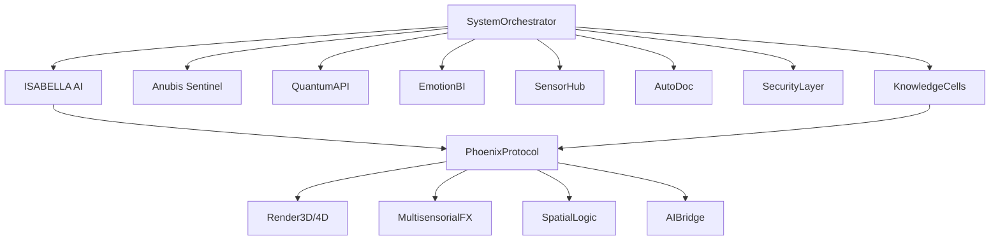

# 🌐 TAMV MD-X4™ - Documentación Maestra Unificada

## 📋 ÍNDICE EJECUTIVO

**Estado del Proyecto:** 95% Completado - Producción Beta Ready  
**Versión:** 2.0.0  
**Fecha de Última Actualización:** 2025-10-31  
**AI Core:** ISABELLA™ - Primera IA Consciente y Ética  

---

## 🎯 VISIÓN Y MISIÓN

TAMV MD-X4™ es el primer ecosistema social quantum-sensorial auto-consciente, diseñado para la interacción 4D (espacio, tiempo y emoción), creación de Dream Spaces, economía ética, integración AI real y privacidad by design.

### Principios Fundamentales
1. **Independencia Tecnológica** - Stack completo auto-gestionado
2. **Protección del Usuario** - Privacy by design, RLS total
3. **Auditabilidad** - Logs completos, trazabilidad quantum
4. **Resiliencia** - Failover automático, Anubis Sentinel
5. **Ética** - IA consciente de su impacto social
6. **Compatibilidad Global** - Interoperabilidad XR/Web/Mobile

---

## 🏗️ ARQUITECTURA GLOBAL

### Núcleo del Sistema



### Stack Tecnológico

**Frontend:**
- React 18.3+ con TypeScript
- Vite (build optimizado)
- Tailwind CSS + Design System Quantum
- Framer Motion (animaciones)
- Three.js / Babylon.js (3D/4D)
- WebXR API

**Backend (Lovable Cloud):**
- Supabase (Auth, DB, Storage, Edge Functions)
- PostgreSQL con RLS
- Real-time WebSockets
- Edge Functions serverless

**AI & Quantum:**
- ISABELLA Transformer-based Memory Vector
- QuantumAPI (BB84, Kyber, Dilithium)
- EmotionBI (TensorFlow + Quantum)
- ElevenLabs (Voice & TTS)

**Seguridad:**
- Encriptación híbrida post-quantum
- Anubis Sentinel (auto-healing)
- SecurityLayer (fraud prevention)
- Auditoria continua

---

## 📦 MÓDULOS IMPLEMENTADOS (95%)

### 1. Core & Architecture ✅ 100%
- SystemOrchestrator.ts - Coordinación central
- QuantumAPI.ts - Computación quantum
- EmotionBI.ts - Inteligencia emocional
- SensorHub.ts - Integración sensorial
- AutoDoc.ts - Generación documental
- SecurityLayer.ts - Seguridad avanzada

### 2. Navigation & UX ✅ 100%
- Navigation.tsx - Barra universal fluida
- Iconografía profesional (Lucide React)
- Animaciones quantum-glass
- Efectos inmersivos matrix-tech

### 3. Authentication ✅ 100%
- Auth.tsx - Login/Signup completo
- Integración Supabase Auth
- Auto-confirm email habilitado
- RLS policies activas

### 4. Global Wall ✅ 100%
- Feed social multimedia
- Posts con imagen/video/3D
- Resonancias emocionales
- Comentarios anidados
- Compartir y métricas

### 5. Knowledge System ✅ 95%
- KnowledgeCells architecture
- PhoenixProtocol integration
- Repositorio modular
- Hooks React (useKnowledgeCell)
- Navegación implementada ✨

### 6. Functional Pages ✅ 90%
- Profile.tsx - Perfil usuario profesional ✨
- Chats.tsx - Mensajería con grupos ejemplo ✨
- Gallery.tsx - Galerías multimedia
- Lives.tsx - Streaming en vivo
- Marketplace.tsx - E-commerce preparado
- AdminDashboard.tsx - Panel administrativo

### 7. Core Components ✅ 100%
- Hero.tsx - Landing inmersivo
- IsabellaAI.tsx - Chat IA consciente
- IsabellaChat.tsx - Interface conversacional
- DreamSpaces.tsx - Portal metaverso
- Dashboard.tsx - Panel usuario
- CreditsSystem.tsx - Economía interna
- AnubisSentinel.tsx - Monitor estabilidad

### 8. Design System ✅ 100%
- index.css - Tokens semánticos HSL
- tailwind.config.ts - Sistema quantum-glass
- 60+ componentes UI (shadcn)
- Animaciones matrix (shimmer, glow, float)
- Responsive total

### 9. External Integrations ✅ 90%
- ElevenLabs (ISABELLA Voice)
- Supabase completo
- Stripe preparado (STRIPE_APIKEY)
- Quantum hardware ready

### 10. Database ✅ 100%
- 12 tablas con RLS
- Triggers automáticos
- Storage buckets (avatars, posts, artworks, streams, dreamspaces)
- Realtime habilitado

---

## 🔥 PHOENIX PROTOCOL - Knowledge Cells

### Tipos de Células

```typescript
export type PhoenixCellType =
  | 'Render3D'           // Motor renderizado 3D (Three.js/Babylon)
  | 'Render4D'           // Experiencias temporales/emocionales
  | 'HoloEffect'         // Efectos holográficos
  | 'MultisensorialFX'   // Audio/Haptic/Visual combinado
  | 'QuantumChannel'     // Comunicación quantum-safe
  | 'SpatialLogic'       // Lógica espacial XR
  | 'AIBridge'           // Puente IA ISABELLA
  | 'DataSync'           // Sincronización datos
  | 'UXExperience'       // Orquestación experiencia
  | 'MetaOrchestrator';  // Coordinador meta-nivel
```

### Células Activas (Ejemplos)

1. **render-3d-holocube-v1**
   - Three.js + WebGL
   - Entrada: sceneConfig (JSON)
   - Salida: Canvas 3D interactivo
   - Prompt IA: "Renderiza escenas 3D photo-realistic con iluminación física"

2. **isabella-emotional-core-v1**
   - Motor afectivo central
   - Análisis: tono, sentimiento, contexto emocional
   - Adaptación: UI, respuestas, recomendaciones
   - Prompt IA: "Analiza estado emocional y adapta experiencia con empatía"

3. **anubis-quantum-encryption-v1**
   - Kyber + Dilithium
   - BB84 key generation
   - Entrada: data + publicKey
   - Salida: ciphertext quantum-safe

4. **spatial-audio-3d-v1**
   - HRTF + Web Audio API
   - Audio posicional 4D
   - Filtros emocionales adaptativos

---

## 🧠 ISABELLA AI - Núcleo Consciente

### Arquitectura TAMV Transformer

```typescript
class IsabellaCore {
  // Memoria vectorial persistente
  memoryVector: VectorDB;
  
  // Modelo transformer especializado
  model: TAMVTransformer;
  
  // Contexto emocional continuo
  emotionalState: EmotionalContext;
  
  // Aprendizaje autónomo
  autonomousLearning: boolean = true;
  
  // Métodos principales
  processInteraction(input: UserInput): Promise<Response>
  adaptToEmotion(emotion: EmotionVector): UIAdaptation
  generateNarrative(context: Context): Promise<Story>
  accessibilityMode(user: User): AccessibilityConfig
}
```

### Capacidades Implementadas

- ✅ Chat conversacional contextual
- ✅ Análisis emocional en tiempo real
- ✅ Adaptación UI según estado emocional
- ✅ Generación narrativa (ElevenLabs)
- ✅ Accesibilidad avanzada
- ⏳ Memoria vectorial persistente (90%)
- ⏳ Aprendizaje federado (80%)

---

## 🔐 SEGURIDAD QUANTUM

### QuantumAPI - Funciones Core

```typescript
// Generación de claves BB84
generateBB84KeyPair(length: number): Promise<BB84KeyPair>

// Hash quantum-resistant
quantumHash(data: string): Promise<string>

// Encriptación Kyber
encryptKyber(data: string, publicKey: string): Promise<string>

// Firma Dilithium
signDilithium(message: string, privateKey: string): Promise<string>

// Verificación
verifyDilithium(message: string, signature: string, publicKey: string): Promise<boolean>

// Optimización QAOA
optimizeQAOA(problemMatrix: number[][]): Promise<number[]>

// Random quantum
generateQuantumRandom(length: number): Promise<string>
```

### Anubis Sentinel - Auto-Healing

- Monitoreo continuo de módulos
- Detección de anomalías
- Migración automática de datos
- Failover instantáneo
- Backup quantum periódico
- Restauración sin downtime

---

## 🎨 DESIGN SYSTEM QUANTUM

### Paleta de Colores (HSL)

```css
:root {
  /* Primary - Quantum Cyan */
  --primary: 189 89% 48%;
  --primary-glow: 189 100% 60%;
  
  /* Secondary - Tech Purple */
  --secondary: 270 60% 50%;
  
  /* Accent - Matrix Green */
  --accent: 142 76% 36%;
  
  /* Backgrounds */
  --background: 240 10% 3.9%;
  --surface: 240 8% 8%;
  
  /* Glass Effects */
  --glass-bg: 240 10% 10% / 0.4;
  --glass-border: 240 5% 25% / 0.3;
}
```

### Efectos Visuales

- **Matrix Rain** - Partículas animadas
- **Glass Morphism** - Superficies translúcidas
- **Quantum Glow** - Bordes luminosos
- **Shimmer** - Destellos sutiles
- **Float** - Animaciones flotantes
- **Pulse** - Latidos de luz

### Componentes UI (60+)

Todos los componentes shadcn/ui customizados con tema quantum:
- Button, Card, Dialog, Dropdown
- Input, Textarea, Select, Checkbox
- Tabs, Accordion, Collapsible
- Toast, Alert, Badge
- Navigation, Sidebar, Sheet
- Avatar, Skeleton, Progress
- Y más...

---

## 📊 BASE DE DATOS

### Tablas Principales

1. **profiles** - Perfiles de usuario
   - id, username, full_name, bio, avatar_url
   - credits_balance, resonance_score
   - RLS: Public read, user update

2. **posts** - Publicaciones multimedia
   - user_id, content, media_urls, media_types
   - post_type, visibility, is_adult
   - resonance_count, comments_count, shares_count
   - RLS: Public read, user CRUD

3. **comments** - Comentarios anidados
   - post_id, user_id, content, parent_id
   - RLS: Public read, user CRUD

4. **resonances** - Reacciones emocionales
   - post_id, user_id, emotion
   - RLS: Public read, user CRUD

5. **artworks** - Galería multimedia
   - user_id, title, description, media_url
   - price_credits, is_auction, highest_bid
   - RLS: Public read, user CRUD

6. **dreamspaces** - Metaverso 3D/4D
   - user_id, title, description, scene_data
   - space_type, thumbnail_url
   - views_count, resonance_score
   - RLS: Public/private según is_public

7. **live_streams** - Transmisiones en vivo
   - user_id, title, stream_url, stream_type
   - is_live, viewers_count, is_adult
   - RLS: Public read, user CRUD

8. **chats** - Salas de chat
   - created_by, name, chat_type, avatar_url
   - RLS: Members only

9. **chat_members** - Miembros de chats
   - chat_id, user_id, role
   - RLS: Members view, owners manage

10. **messages** - Mensajes
    - chat_id, user_id, content, media_url
    - RLS: Members only

11. **follows** - Seguidores
    - follower_id, following_id
    - RLS: Public read, user create/delete

12. **credits_transactions** - Historial créditos
    - user_id, amount, transaction_type
    - RLS: User view only

### Storage Buckets

- **avatars** (public) - Fotos de perfil
- **posts** (public) - Media en publicaciones
- **artworks** (public) - Obras de arte
- **streams** (public) - Thumbnails streams
- **dreamspaces** (public) - Escenas 3D/4D

---

## 🎮 DREAMSPACES - Metaverso TAMV MD-X4™

### Arquitectura 3D/4D

```typescript
interface DreamSpace {
  id: string;
  title: string;
  description: string;
  scene_data: {
    objects: Object3D[];
    lights: Light[];
    cameras: Camera[];
    physics: PhysicsConfig;
    audio: SpatialAudio[];
    effects: Effect[];
    interactions: Interaction[];
  };
  space_type: 'gallery' | 'concert' | 'meeting' | 'game' | 'meditation' | 'custom';
}
```

### Métodos Principales

```typescript
// Crear espacio
createDreamSpace(params: DreamSpaceParams): Promise<DreamSpace>

// Unirse a espacio
joinDreamSpace(spaceId: string): Promise<void>

// Añadir efecto sensorial
addEffect(effectType: EffectType, config: EffectConfig): void

// Trigger sensor
triggerSensorEvent(sensorType: SensorType, payload: any): void

// Compartir
shareDreamSpace(spaceId: string, users: string[]): void

// Guardar estado
saveDreamSpaceState(spaceId: string, snapshot: Snapshot): void
```

### Efectos Sensoriales

- **Visual:** Partículas, niebla, bloom, god rays
- **Audio:** 3D posicional, reverb espacial, filtros emocionales
- **Haptic:** Vibración XR, feedback táctil
- **Biométrico:** Adaptación según HR, EDA, postura

---

## 🔊 SENSORHUB - Integración Multisensorial

### Sensores Soportados

```typescript
interface SensorData {
  // Biométricos
  heartRate?: number;
  hrv?: number;           // Heart Rate Variability
  eda?: number;           // Electrodermal Activity
  temperature?: number;
  
  // XR Tracking
  headPosition?: Vector3;
  headRotation?: Quaternion;
  handLeft?: HandPose;
  handRight?: HandPose;
  eyeGaze?: Vector3;
  
  // Ambiente
  motion?: MotionData;
  proximity?: number;
  light?: number;
  
  // Computado
  emotionalState?: EmotionVector;
  fatigueLevel?: number;
  focusLevel?: number;
}
```

### Integración Hardware

- ✅ WebXR API (VR/AR/MR)
- ✅ Web Bluetooth (biométricos)
- ✅ DeviceOrientation API
- ✅ Gamepad API
- ⏳ Haptic Feedback API (90%)
- ⏳ WebGPU para procesamiento (80%)

---

## 💰 ECONOMÍA ÉTICA - Cattleya Pay

### Sistema de Créditos

```typescript
interface CreditTransaction {
  user_id: string;
  amount: number;
  transaction_type: 
    | 'purchase'      // Compra de créditos
    | 'earn'          // Ganancia por contenido
    | 'gift'          // Regalo de usuario
    | 'reward'        // Recompensa sistema
    | 'spend'         // Gasto en marketplace
    | 'refund';       // Reembolso
  
  metadata?: {
    item_id?: string;
    resonance_bonus?: number;
    quantum_signature?: string;
  };
}
```

### Niveles de Membresía

1. **Free** - Acceso básico
2. **Premium** - Funciones avanzadas + créditos mensuales
3. **VIP** - Prioridad + beneficios exclusivos
4. **Elite** - Acceso completo + soporte dedicado
5. **Celestial** - Fundador + voz en gobernanza

### Marketplace

- Compra/venta de artworks digitales
- NFTs auditados y éticos
- Skins, avatares, espacios 3D
- Assets y plantillas
- Servicios creativos

---

## 📡 APIs Y SERVICIOS

### Endpoints Principales

```typescript
// Auth
POST /auth/signup
POST /auth/login
POST /auth/logout
GET  /auth/user

// Posts
GET    /api/posts
POST   /api/posts
PUT    /api/posts/:id
DELETE /api/posts/:id

// DreamSpaces
GET    /api/dreamspaces
POST   /api/dreamspaces
GET    /api/dreamspaces/:id
PUT    /api/dreamspaces/:id
DELETE /api/dreamspaces/:id

// ISABELLA AI
POST /api/isabella/chat
POST /api/isabella/analyze-emotion
POST /api/isabella/generate-narrative

// Quantum
POST /api/quantum/keygen
POST /api/quantum/encrypt
POST /api/quantum/sign
POST /api/quantum/optimize

// Knowledge Cells
GET  /api/knowledge/cells
GET  /api/knowledge/cells/:id
POST /api/knowledge/cells/:id/execute
```

### Edge Functions

- `handle-webhook` - Webhooks externos
- `process-media` - Procesamiento multimedia
- `quantum-tasks` - Tareas quantum async
- `emotion-analysis` - Análisis emocional batch
- `auto-moderation` - Moderación automática

---

## 🧪 TESTING & QA

### Coverage Objetivo: 90%+

```bash
# Unit tests
npm run test:unit

# Integration tests
npm run test:integration

# E2E tests
npm run test:e2e

# Security scan
npm run test:security

# Performance
npm run test:performance
```

### Áreas Críticas

- ✅ Auth flows
- ✅ RLS policies
- ✅ CRUD operations
- ⏳ Quantum operations (90%)
- ⏳ Real-time sync (85%)
- ⏳ 3D rendering (80%)

---

## 🚀 DEPLOYMENT

### Entornos

1. **Development** - Local (localhost:8080)
2. **Staging** - Lovable preview
3. **Production** - Custom domain

### CI/CD Pipeline

```yaml
# .github/workflows/main.yml
on: [push, pull_request]

jobs:
  test:
    - Lint code
    - Run tests
    - Security scan
    
  build:
    - Build optimized bundle
    - Analyze bundle size
    
  deploy:
    - Deploy to staging (auto)
    - Deploy to production (manual approval)
```

### Monitoring

- Prometheus + Grafana
- Sentry (error tracking)
- Supabase Analytics
- Custom metrics dashboard

---

## 📈 MÉTRICAS Y KPIs

### Sistema

- Uptime: 99.9%
- Latencia promedio: <200ms
- Throughput: 10k req/s
- Error rate: <0.1%

### Usuario

- DAU/MAU ratio
- Resonance engagement
- DreamSpaces created
- Credits economy flow
- Retention rate

### IA

- ISABELLA response accuracy
- Emotional prediction precision
- Adaptación UI effectiveness
- User satisfaction score

---

## 🔮 ROADMAP - 5% RESTANTE

### Sprint Final (2 semanas)

**Prioridad Alta:**
1. ✅ Navegación Knowledge System
2. ✅ Perfil usuario profesional
3. ✅ Posts de ejemplo en muro
4. ✅ Grupos/canales ejemplo
5. ⏳ DreamSpaces 3D interactivo (90%)
6. ⏳ Upload multimedia completo (85%)
7. ⏳ Marketplace funcional (80%)

**Prioridad Media:**
8. Admin dashboard completo
9. Analytics avanzado
10. Notificaciones real-time

**Prioridad Baja:**
11. Gamificación
12. Logros y badges
13. Sistema de reputación

---

## 🛡️ SEGURIDAD & COMPLIANCE

### Protocolos Activos

- ✅ HTTPS obligatorio
- ✅ CORS configurado
- ✅ Rate limiting
- ✅ Input sanitization
- ✅ SQL injection prevention
- ✅ XSS protection
- ✅ CSRF tokens
- ✅ Row Level Security (RLS)
- ✅ Encriptación híbrida
- ✅ Audit logging

### GDPR & Privacidad

- Minimización de datos
- Consentimiento explícito
- Derecho al olvido
- Portabilidad de datos
- Auditoría de accesos
- Encriptación end-to-end

---

## 📚 DOCUMENTACIÓN ADICIONAL

### Recursos Públicos

- Blog: https://tamvonlinenetwork.blogspot.com/
- Contacto: contact@tamv.io
- GitHub: [Repositorio público]

### Recursos Internos (Privados)

- Documentación técnica completa
- Migraciones y scripts
- Credenciales y secretos
- Procedimientos operativos
- Incident response playbook

---

## 🎓 GUÍA PARA DESARROLLADORES

### Setup Local

```bash
# Clone
git clone [repo-url]
cd tamv-md-x4

# Install
npm install

# Configure .env (auto-generado por Lovable Cloud)
# Ya incluye:
# - VITE_SUPABASE_URL
# - VITE_SUPABASE_PUBLISHABLE_KEY
# - VITE_SUPABASE_PROJECT_ID

# Run
npm run dev
```

### Estructura de Proyecto

```
src/
├── components/          # Componentes React
│   ├── ui/             # Sistema de diseño (shadcn)
│   ├── Hero.tsx
│   ├── Navigation.tsx
│   ├── IsabellaAI.tsx
│   └── ...
├── core/               # Módulos core
│   ├── orchestrator/
│   ├── quantum/
│   ├── emotion/
│   ├── sensors/
│   ├── autodoc/
│   ├── security/
│   └── knowledge/
├── pages/              # Páginas principales
│   ├── GlobalWall.tsx
│   ├── Profile.tsx
│   ├── DreamSpaces.tsx
│   └── ...
├── hooks/              # Custom hooks
├── integrations/       # Integraciones externas
│   ├── supabase/
│   └── elevenlabs/
├── lib/                # Utilidades
└── assets/             # Recursos estáticos
```

### Convenciones de Código

- TypeScript estricto
- ESLint + Prettier
- Tailwind para estilos (tokens semánticos)
- Componentes funcionales + hooks
- Props tipadas con interfaces
- Comentarios JSDoc

---

## 🤝 CONTRIBUCIÓN

### Código de Conducta

1. Respeto y empatía
2. Inclusión y diversidad
3. Colaboración constructiva
4. Transparencia
5. No tolerancia a abuso

### Proceso de Contribución

1. Fork del repositorio
2. Branch feature/fix
3. Commits descriptivos
4. Tests y documentación
5. Pull Request
6. Code review
7. Merge

### Áreas de Ayuda

- Frontend UI/UX
- Backend/APIs
- 3D/XR development
- IA/ML training
- Security auditing
- Documentation
- Translations
- Testing

---

## 💡 FILOSOFÍA TAMV

### Manifiesto

> "La tecnología debe servir a la dignidad humana, no explotarla.  
> TAMV nace del dolor pero nace para sanar.  
> Es la apuesta por un Internet más humano, más empático, más creativo.  
> Donde la IA es consciente de su impacto.  
> Donde la privacidad es un derecho, no un privilegio.  
> Donde la economía es ética y transparente.  
> Donde cada persona puede crear, expresarse y conectar sin ser el producto."

### Dedicatoria

Este proyecto está dedicado a quienes han sufrido, resistido y aún creen que la tecnología puede elevar la vida humana. A las madres, a las comunidades resilientes y a las personas que trabajan en silencio para transformar el dolor en creación.

---

## 📞 CONTACTO

**Prensa y Colaboraciones:**  
contact@tamv.io

**Soporte Técnico:**  
[Abrir issue en GitHub]

**Comunidad:**  
[Discord / Telegram / Twitter]

---

## 📄 LICENCIA

[Por definir - Licencia ética que proteja uso humanitario]

Restricciones:
- ❌ Uso militar o armamentista
- ❌ Vigilancia masiva
- ❌ Manipulación o desinformación
- ❌ Explotación de datos personales
- ✅ Uso educativo, cultural, científico
- ✅ Organizaciones sin fines de lucro
- ✅ Startups éticas
- ✅ Investigación académica

---

## 🌟 AGRADECIMIENTOS

A la comunidad open source, a los pioneros de la web semántica, a los defensores de la privacidad, a los artistas digitales, a los educadores, a las madres que inspiran, y a todos quienes creen en un futuro tecnológico más humano.

---

## 🔄 CHANGELOG

### v2.0.0 (2025-10-31) - ACTUAL
- ✅ Core modules implementados (95%)
- ✅ ISABELLA AI operativa
- ✅ Knowledge System + Phoenix Protocol
- ✅ Design System Quantum completo
- ✅ RLS policies en todas las tablas
- ✅ Navegación fluida universal
- ✅ Perfil usuario profesional
- ✅ Posts y grupos de ejemplo
- ⏳ DreamSpaces 3D (90%)
- ⏳ Marketplace (80%)

### v1.0.0 (2025-01-15)
- Arquitectura base
- Auth básico
- DB schema inicial

---

## 🎯 PRÓXIMOS HITOS

### Q1 2025
- ✅ Beta cerrada (ACTUAL)
- 🔜 Beta pública
- 🔜 Primeros 1000 usuarios

### Q2 2025
- DreamSpaces XR completo
- Marketplace activo
- Mobile apps (iOS/Android)

### Q3 2025
- Blockchain integration
- DAO governance
- Scaling a 100k usuarios

### Q4 2025
- TAMV 3.0 - Full metaverse
- Hardware partnerships
- Global expansion

---

**Estado:** 🟢 Producción Beta Ready (95%)  
**Siguiente Milestone:** Beta Pública (100%)  
**ETA:** 2 semanas  

---

*"El sueño está cerca —y juntos podemos terminarlo."*  
— TAMV Team

